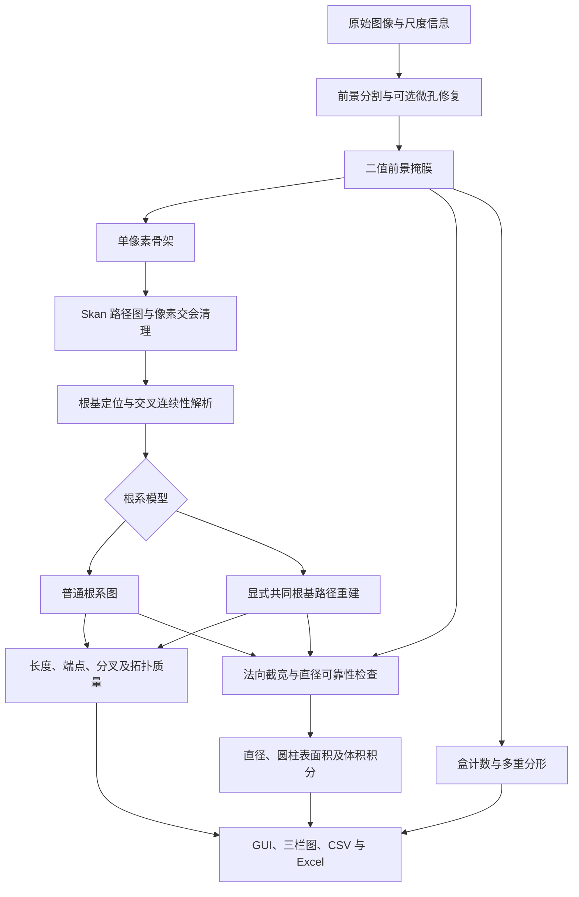

# Root Architecture V1.0.0：算法、数学定义与 CEA 论文方法说明

作者：唐清芸（石河子大学农学院、新疆农垦科学院）  
软件版权人：王国栋（新疆农垦科学院）  
核对日期：2026-09-15

本文面向软件复现和 *Computers and Electronics in Agriculture*（CEA）论文撰写，按当前可执行源码说明计算过程。安装、Windows/macOS 操作、GUI、命令行和 EXE 使用方法见 [使用手册](USER_GUIDE.md)。

**研究对象是根系的二维图像投影。软件输出包括直接可见的图像测量、由几何连续性支持的连接假设，以及用户明确选择模型后的推断量。这三类信息不能混为真实根系的已验证测量。** 单张图像中完全遮挡的根尖、根数、根径及三维弯曲不能唯一恢复。当前复杂根系示例尚未完成实物真值验证，本文提供方法描述，不能代替论文的精度实验。

数学公式采用 GitHub Markdown 支持的 `$...$` 行内数学和 `$$...$$` 独立公式。公式不放在代码块内；应在 GitHub 的渲染视图阅读。

## 1. 软件结构与计算链

| 模块 | 当前职责与关键函数 |
|---|---|
| `preprocess.py` | 灰度转换、六种分割入口、可选后处理、PNG 骨架输出；`process_single_image` |
| `root_segmentation.py` | 强弱阈值连接分割；`segment_root_intensity` |
| `root_crown.py` | 有记录的微孔处理、贴合束候选、显式共同根基追踪 |
| `root_topology.py` | 路径图整理、根基、交叉、树指标、测宽与积分 |
| `root_analysis.py` | 单样本分析、FD/MF、单位转换、批处理汇总；`analyze_root_image` |
| `calibration.py` | DPI 与来源；`image_scale` |
| `root_gui.py` | 产品交互与 `AnalysisResultViewer` 结果显示 |

算法采用 NumPy、SciPy、scikit-image、Skan 和 NetworkX；PyQt5/Matplotlib 用于 GUI 和绘图。它是规则与图计算流程，不包含通过该数据集训练的深度学习模型。依赖版本以随仓库发布的依赖文件、运行记录及最终提交为准。

### 1.1 三种对象必须区分

1. **前景掩膜** $B(r,c)\in\{0,1\}$：表示二维投影上属于根系的像素，用于截宽和分形。
2. **骨架** $S(r,c)\in\{0,1\}$：细化后的中心路径，用于建图；骨架自身没有足够的宽度信息。
3. **解析路径图** $G=(V,E)$：端点和连接点为顶点，连续像素路径为边；经交叉解析后，图连接关系可能与二值并集的表面接触关系不同。

因此，单像素骨架是拓扑分析的必要表示之一，但不能单独消除根部贴合、真实侧根与投影交叉的歧义，也不能单独计算真实根径。

## 2. 符号、图像输入和尺度

| 符号 | 含义 |
|---|---|
| $H,W$ | 原始图像高、宽，像素 |
| $I(r,c)$ | 归一化灰度，范围 $[0,1]$ |
| $b$ | 根基图节点 |
| $\mathbf p_{e,k}$ | 边 $e$ 的第 $k$ 个路径采样坐标，内部顺序为 `(row, col)` |
| $R(\mathbf p)$ | 二值前景内到最近背景的欧氏距离，像素 |
| $d_k,\Delta l_k$ | 局部直径估计与积分长度权重，像素 |
| $L,A,V_r$ | 根路径总长、圆柱侧表面积、圆柱体积；$V_r$ 与图顶点集 $V$ 区分 |
| $\varepsilon$ | 盒边长，像素 |
| $N(\varepsilon)$ | 非空盒数 |
| $q$ | 多重分形矩阶数 |

### 2.1 图像读取

`preprocess.process_single_image` 将 RGB 转为灰度；8 位和 16 位整数灰度分别除以 255 和 65535。分析入口读取成对二值图和骨架图，并要求其尺寸一致。应保留相同像素网格和裁切范围，不宜对二值图与骨架图分别缩放。

`root_analysis.load_binary_image` 与 `load_skeleton_image` 在 0.5 阈值处判断前景极性：若大于 0.5 的像素占比小于 50%，白色为前景，否则黑色为前景。这是稀疏前景假设，**并非任意高覆盖率图像都适用**。预处理输出统一使用白色前景、黑色背景及无损 PNG。文件读取函数本身不细化，但 `analyze_topology` 仍会对读入的骨架执行一次 `skeletonize`；算法不会在此处从二值掩膜重新替代用户提交的骨架。

### 2.2 物理尺度与单位

`calibration.image_scale` 优先使用显式提供的 DPI，其次读取可信图像元数据；文件名中的 `300`、`600` 等数字不作为标尺。显式 DPI 必须是有限数且位于 10～10000。常规 DPI 元数据检查两个方向的差异小于 1%，以平均值作为各向同性 DPI；TIFF/EXIF 分辨率单位也被识别。

设分辨率为 $D$ DPI，则：

$$
s=\frac{2.54}{D}\quad [\mathrm{cm\,px^{-1}}].
$$

$$
L_{\mathrm{cm}}=sL_{\mathrm{px}},\qquad
d_{\mathrm{mm}}=10s\,d_{\mathrm{px}},\qquad
A_{\mathrm{cm^2}}=s^2A_{\mathrm{px^2}},\qquad
(V_r)_{\mathrm{cm^3}}=s^3(V_r)_{\mathrm{px^3}}.
$$

`Scale_Source='unknown'` 会明确阻止将内部默认 DPI 作为测得尺度输出；厘米、毫米字段置为 `NaN`，界面显示 `N/A`，像素字段保留。元数据本身也可能被图像编辑软件改写，因此论文实验需要扫描分辨率记录或同平面标尺核验。当前实现不执行各向异性像素校正、相机透视标定或三维长度恢复。

## 3. 前景分割

六种分割方法是可选路径，不是每张图依次执行六遍。`process_single_image` 的程序默认方法仍是 `multiscale`；用于四图核查的显式参数见第 13 节。

### 3.1 线稿 `line_art`

适用于亮背景上的深色铜丝线稿，实际规则固定为：

$$
B(r,c)=\mathbf 1\!\left[I(r,c)<\frac{128}{255}\right].
$$

该路径不自动改变前景方向。它跳过旧版边框检测、闭运算、小对象删除和孤立对象删除。仅在显式指定时进行微孔处理，随后骨架化。

### 3.2 强度滞后分割 `intensity`

来源：`root_segmentation.segment_root_intensity`。适用于较均匀的明/暗背景，保留有实际灰度支持的弱对比细根；没有通过形态闭运算补画不可见根段。

1. 图像四周取厚度 $m=\max(1,\lfloor\min(H,W)/100\rfloor)$ 的边缘带，计算背景灰度。
2. 自动极性：边缘灰度中位数小于 0.5 时设亮前景，否则设暗前景。也可显式指定。
3. 构造统一的亮信号 $J=I$（亮前景）或 $J=1-I$（暗前景）。令边缘带信号中位数为 $\beta$，中位绝对偏差为 $\mathrm{MAD}$。
4. Otsu 强阈值和弱阈值定义如下：

$$
T_H=\max\left(T_{\mathrm{Otsu}},\beta+10^{-6}\right),
$$

$$
T_L=\min\left[T_H,\max\left\{\beta+\rho(T_H-\beta),
\beta+4\times1.4826\times\mathrm{MAD}\right\}\right].
$$

令强像素集 $B_H=\{J>T_H\}$，弱像素集 $B_L=\{J>T_L\}$。只保留 $B_L$ 中同时满足下述条件的 **8 连通**分量：包含至少一个强像素，面积不小于 `min_component_area`（函数默认 8 px²）。

函数 `segment_root_intensity` 的 $\rho$ 默认 0.5，产品预处理入口 `intensity_low_ratio` 默认 0.8；复现时必须注明调用入口和实际值。$\rho$ 越小，允许连接的弱信号范围通常越大。没有强种子的弱细根仍可能被漏掉；连接到强根的亮斑也可能被保留。输出记录强弱阈值、保留弱像素比例、前景像素数、连通块数和触边像素数。

Otsu 阈值根据灰度直方图的类间方差准则确定；本文额外的边缘噪声门限与连接规则是本项目实现，不能全部归为 Otsu 原算法。[Otsu 原论文](https://ieeexplore.ieee.org/document/4310076)

### 3.3 全局 Otsu `otsu`

来源：`preprocess.segment_otsu`。给定阈值 $t$，将直方图分为两类，类别权重与均值为 $\omega_0,\omega_1,\mu_0,\mu_1$：

$$
t^*=\underset{t}{\arg\max}\;
\omega_0(t)\omega_1(t)\left[\mu_0(t)-\mu_1(t)\right]^2.
$$

暗前景使用 $I<t^*$，亮前景使用 $I>t^*$。自动模式比较边缘均值与中央区域均值选择极性。掩膜排除区域不参与阈值统计，除非剩余像素少于 10。与 `intensity` 不同，这条旧流程还会执行第 3.6 节后处理。

### 3.4 局部阈值 `adaptive`

来源：`preprocess.segment_adaptive`。图像先转为 8 位灰度，调用 `threshold_local` 的默认 Gaussian 方法，以局部加权灰度减去偏移值作为阈值。默认窗口 51 px，偏移 10（8 位灰度单位）：

$$
T(r,c)=(G_{\sigma}*I_8)(r,c)-C.
$$

按所选前景极性比较 $I_8$ 与 $T$。窗口和偏移均影响细根与背景的分界，不能视为物理常数。

### 3.5 纹理 `texture` 与多尺度 `multiscale`

来源：`segment_texture`、`segment_multiscale`。局部窗口均值、标准差和暗对比为：

$$
\mu_w=\operatorname{mean}_w(I),\qquad
\sigma_w=\sqrt{\max\{\operatorname{mean}_w(I^2)-\mu_w^2,0\}},\qquad
\delta_w=\max(\mu_w-I,0).
$$

$$
F_w=0.6\sigma_w+0.4\delta_w.
$$

每个尺度的 $F_w$ 除以其全图最大值归一化。单尺度默认窗口 25；对 $F_w>0.005$ 的像素计算 Otsu 阈值。

多尺度选择 $w_f=\max(5,\lfloor w_c/3\rfloor)$，$w_c=25$，融合 $F=\max(F_{w_f},F_{w_c})$。默认方块边长先取 $\max(256,\lfloor\min(H,W)/5\rfloor)$，再限制不超过图像短边；重叠宽度为 $\max(32,\lfloor0.25t\rfloor)$。每块有效像素数至少 200 才投票，在该块阈值 $0.88T_{\mathrm{Otsu}}$ 以上投前景票：

$$
B(r,c)=\mathbf 1\!\left[
\frac{\text{该像素获得的前景票数}}{\text{覆盖该像素的块数}}\geq0.40
\right].
$$

这两种方法的暗对比项假设暗根、亮背景，不因 `foreground` 参数反转。局部纹理可能扩大细线周围的响应区域，因而与直接强度分割得到的宽度、连接关系不同。上述常数是实现参数，论文需报告实际选用方法并做参数敏感性实验。

### 3.6 旧分割流程的边框与形态后处理

仅 `multiscale/texture/otsu/adaptive` 执行以下完整流程；`line_art/intensity` 跳过这些步骤。

| 步骤 | 当前程序默认规则 |
|---|---|
| 扫描边框 | 找到灰度低于 0.25 或高于 0.92 且与图像边缘连通的区域，合并后膨胀 10 次 |
| 闭运算 | 使用半径 3 px 的圆盘；半径为 0 则关闭 |
| 小对象去除 | `remove_small_objects`，面积阈值 500 px² |
| 小孔填充 | `remove_small_holes`，面积阈值 200 px² |
| 边缘对象 | 检查 20 px 边缘带，删除面积不超过全图前景面积 10% 的触边分量 |
| 孤立噪声 | 主区域为面积至少最大分量 2% 的分量，删除距离主区域超过 150 px 的小分量 |

闭运算可写为：

$$
B\bullet K=(B\oplus K)\ominus K,
$$

其中 $K$ 为结构元素。此操作可能连接相邻根；填孔可能消除真实环；小对象/边缘对象删除可能去掉真实细根或截断根。因此不能把这条流程描述成不改变拓扑的无损去噪。纯黑背景与图像边缘连通时，旧边框检测还可能侵蚀根系边界。四图研究使用的 `line_art/intensity` 路径正是为避免自动执行这些旧操作。

### 3.7 显式微孔修复

来源：`root_crown.repair_microholes`。只填补同时满足以下条件的背景连通分量 $C$：

$$
C\cap\partial\Omega=\varnothing,\qquad
|C|\leq A_{\max},\qquad
\max_{\mathbf p\in C}\operatorname{EDT}_C(\mathbf p)\leq R_{\max}.
$$

默认函数上限为 4 px²、1 px；**产品预处理默认 `pixel_hole_area=0`，即关闭**。背景默认 8 连通，可显式改为 4 连通；后者会将某些对角单像素缝识别成封闭孔，可能合并两根之间的细缝。返回原掩膜副本和修复像素坐标、质心、面积、内切半径等记录；预处理 PNG 元数据保存摘要。

该操作只具有明确参数和可追溯性，不证明被填像素原本一定是成像伪影。

## 4. 骨架、路径图和像素级修正

### 4.1 骨架化与 Skan 图

`compute_skeleton` 和 `analyze_topology` 使用 scikit-image 的 `skeletonize`。二维默认使用 Zhang 细化方法，逐步去除边缘像素形成细线表示。它不同于用欧氏距离变换单独求出的严格中轴变换。[scikit-image 官方说明](https://scikit-image.org/docs/stable/api/skimage.morphology.html#skimage.morphology.skeletonize)

`skan.Skeleton` 和 `skan.summarize` 将骨架转换为邻接像素图和节点间路径；相邻像素的原始距离通常为 1 或 $\sqrt 2$。本项目保留每条路径的坐标序列，随后自行进行连接整理及长度修正。[Skan 官方教程](https://github.com/jni/skan/blob/main/doc/getting_started/getting_started.md)

**最终根长不是骨架像素数，也不是 Skan 的原始逐步距离总和。** 实际最终长度使用第 7 节的弦段计算。二值图决定前景宽度，骨架决定路径；人工编辑后必须核查二者是否仍相互匹配。

### 4.2 交会像素团清理

来源：`consolidate_junction_pixels`、`contract_degree_two`。

- 对两个度数均不小于 3、相连路径长度不大于 3.5 px 的节点形成连通组，合并为节点坐标均值，删除组内短链接，并将对外路径接到该中心。
- 删除长度不大于 2 px 且连接度数不小于 3 节点的短末梢。
- 不受保护的度数为 2 节点被收缩为一条连续路径；不把普通线中间的每个像素都当作分叉。

这些是栅格级启发式处理，会影响低分辨率的真实短分枝，不能宣称任意分辨率下严格拓扑不变。

### 4.3 可选短枝剪除和端帽伪枝

低层接口 `analyze_topology` 的 `min_spur_mm` 默认 0。显式大于 0 时，只剪除连接末端与分叉的短边，阈值换算为：

$$
L_{\mathrm{cut,px}}=\frac{D}{25.4}L_{\mathrm{cut,mm}}.
$$

该参数不是 `analyze_root_image` 的同名公开参数，使用时应记录调用层级。没有物理标尺时不应把毫米阈值当作已知实验尺度。

此外存在独立的端帽清理：非根基末梢若连接分叉或根冠，且路径长度小于交会处 $1.5R$，将删除并计入 `Raster_Pruned_Spurs`。因此“未启用 `min_spur_mm`”不等于“整个流程绝不剪除任何短枝”。

## 5. 根基、根冠、可见端点与分叉

### 5.1 根基的确定

优先使用有效的显式根冠矩形；否则将显式 `base_rc` 映射到最近图节点；否则根据 `root_direction` 在主连通分量中选最接近根基方向的节点。主分量根据其边路径采样点数之和选择，防止图顶端的孤立噪点被当作根基。默认方向 `top`；可选 `bottom/left/right/none`。

`none` 表示不指定根基，适合分离根段；此时全部度数为 1 的节点都作为可见端点，无法给出有根树的 TI、级序和定向分枝角。

### 5.2 局部根冠汇聚推断

来源：`crown_axis_convergence`。仅在没有显式根基坐标/矩形时尝试。首先要求根基候选为单端点、其后短茎连接分叉，收集短距离内交会节点。根据离开该区域的根轴方向拟合交点：

$$
\hat{\mathbf x}=\underset{\mathbf x}{\arg\min}
\sum_i\left(\mathbf n_i^\mathsf T\mathbf x-a_i\right)^2,
$$

其中 $\mathbf n_i$ 是出射根轴法向，$a_i$ 为拟合直线偏移。要求法方程有二维秩、拟合交点距原根基不超过局部代表宽度、短茎长度不超过约 3 倍宽度，最大直线残差不超过半个代表宽度。由此构造局部冠区，保留可见末端且拒绝未消解的内部环。该推断只针对局部多轴汇聚，不自动解释整个贴合根束。

### 5.3 显式根冠矩形

来源：`resolve_crown_region`。`crown_box=(r0,c0,r1,c1)` 必须有有限且顺序正确的坐标，包含图节点并在矩形内部连通。函数使用原图中的最短路径连接根基和各条出射路径，保留路径几何；共享冠区路径可能被重复分配给不同出射根。

手工矩形代表用户选择的冠区解释，矩形内连接可被合并；它不是自动证明冠区内部没有侧分枝。无效矩形会返回 `invalid_crown` 和错误信息，不默默补造树。伴随二值图的 `.review.json` 可提供矩形标注。

### 5.4 计数定义

对最终解析图：

$$
N_{\mathrm{tips}}=\#\{v\in V:\deg(v)=1,\ v\neq b\},
$$

$$
N_{\mathrm{forks}}=\#\{v\in V:\deg(v)\geq3,\ v\neq b\},
\qquad
N_{\mathrm{junctions}}=N_{\mathrm{forks}}+N_{\mathrm{crossings}}.
$$

根基不计入根尖或分叉。一个有多条子根的节点仍计 1 个 `Num_Forks`；**分叉点数不等于侧根条数或根轴数**。交叉计数为解析过程中记录的几何交叉事件数，不再作为相连的生物分叉。

按当前产品口径，`Num_Tips` 是**排除根基后的可见图端点总数**，包括碎片端点、触边端点和疑似裁切端点。疑似裁切端点并入可见端点显示，不另外加总；后台诊断字段继续保留。上述诊断类别可能重叠，不能将其数量相加再当作额外根尖。真实根系中，断裂端点并不等于活体生长根尖。

`possible_crop_endpoints` 仅在至少 3 个端点、前景两侧余边近似对称且不超过对应图像尺寸 5%、多个端点在距前景包围框约 1.5 px 的位置对齐时标记疑似内嵌裁切边；它不删点，也不复原被裁去部分。

## 6. 投影交叉解析

来源：`root_topology.resolve_crossings`。一条根穿过另一条根，可能在细化图上表现为一个四臂点，也可能表现为两个三臂点由一小段重合路径连接。算法同时检查这两种情形。

### 6.1 四臂连续性

对候选的每条外臂，估计局部宽度 $w_i$ 和向外单位方向 $\mathbf u_i$，方向取样距离为 $\max(12,4w)$，其中 $w\geq2$ px 为四臂代表宽度。对可能的配对计算偏离直线的角度：

$$
\delta_{ij}=180^\circ-\arccos\!\left(
\operatorname{clip}(\mathbf u_i^\mathsf T\mathbf u_j,-1,1)
\right)\frac{180^\circ}{\pi}.
$$

两对均要求 $\delta\leq25^\circ$，两根轴之间的锐角 $\theta\geq12^\circ$。对两个三臂点之间的连接长度 $L_c$，还要求：

$$
L_c\leq\frac{2.5w}{\max(\sin\theta,0.2)}.
$$

可选 `cross_merge_mm` 在低层接口提供额外的距离上限。满足条件的配对按偏离角之和由小到大试验。每次接续后重新检查图，允许同一根经过多次交叉。原有路径坐标被拼接，交叉位置单独记录。

### 6.2 五至八臂交会

对于 5～8 臂节点，可先分离一对明确贯穿轴，保留其余臂和交会关系：对向偏离不超过 $12^\circ$，两臂宽度比不超过 1.8（实现中的最小宽度保护为 1 px），有足够长度用于方向估计，且至少另两条臂与该轴形成大于 $20^\circ$ 的夹角。此规则不等于完整识别任意多根同点重叠。

### 6.3 短臂上下文与保护

`crossing_context=True` 时，局部配对无法再推进后，允许沿短臂继续查找明确的近直线出口：最佳出口转角不超过 $35^\circ$，且与次优出口至少相差 $15^\circ$，最多延续 8 次。该信息补充方向判断，不删除不明确交会。

整株定向模式拒绝使连通分量数增加的接续，保护根基节点，避免将一个真实分叉拆成两株。分离根段模式允许不同根轴在投影交叉处解连。连通性约束也可能阻止部分真实交叉被自动解开，因此交叉数仍是候选结果。

**剩余环会保留并报告。算法不通过最小生成树或任意删边强行消环。** 规则不能仅凭一张二值图证明根的生物连接，尤其对近共线贴合、短段、多重交会、端点遮挡等情况。

## 7. 根系模型与路径长度

### 7.1 普通模型 `general`

默认保留解析图中的侧分叉。没有明确多根身份的贴合段可能仍作为一条较粗的投影路径。普通模型的根轴总数不由 `Num_Forks` 或图边数自动推出。

### 7.2 显式共同根基模型 `shared_crown`

来源：`root_crown.trace_shared_crown`。调用者明确假设“多条独立、无侧分枝的根从共同根基出发”。只在有根基、全图连通、无环且至少两个可见远端时应用；否则保留原分析并报告拒绝原因。

对于每个可见末端，沿唯一父路径回溯至根基。若某条观测边被 $m_e$ 条末端路径经过，其根身份在共享段内不直接可见，但该段属于这些模型根路径中的每一条。示意上：

$$
L_{\mathrm{observed}}\approx\sum_e L_e,\qquad
L_{\mathrm{expanded}}\approx\sum_e m_eL_e.
$$

**程序实际值**分别对观测图每条路径、展开后的每条完整根路径使用第 7.3 节弦段公式后再求和；拼接使弦段分组发生变化，上式按边重数计算与实际展开长度可能有小的离散差异。

共享位置以 `Edge.inferred_mask` 标记，输出观测长度、展开长度、增加长度及推断路径比例。原图保留在 `_observed_edges`，模型根路径保留在 `_resolved_edges`。原分离位置记录为 `Num_Bundle_Separations`；它们在选定模型下不计为侧根分叉。`Topology_Status='model_assumed'` 明确说明该结果依赖模型。

模型内的“0 个侧分叉”是前提产生的结果，不能用它反过来证明前提正确。真实近端增粗、侧根发生、根轴融合等情况不满足无侧分枝常径铜丝的解释。

### 7.3 五采样点弦段长度

来源：`Edge.length`。对每条路径采样序号取 $0,5,10,\ldots$ 并始终加入末点，设该索引集合依次为 $a_0,\ldots,a_m$：

$$
L_e=\sum_{j=0}^{m-1}
\left\|\mathbf p_{e,a_{j+1}}-\mathbf p_{e,a_j}\right\|_2,
\qquad
L=\sum_{e\in E}L_e.
$$

这里“5”指**路径采样点索引间隔**，不是严格等于 5 px 的连续弧长。用弦段减弱数字阶梯路径对斜线长度的高估，同时可能低估间隔内的急弯；节点和端点保留。不同缩放与不同路径分段可能引入误差，需用连续几何真值评价。

### 7.4 端点延伸

来源：`extend_terminals`。骨架端点可能停在粗根端帽内部。对采样点数至少 8 的末端路径，沿其向外方向以 0.25 px 步长检查二值掩膜的双线性插值值，找到降到 0.5 的边界并线性插值。搜索上限为 $\max(3,3R)$ px。该延伸仅到图中前景边界，不增加被遮挡或裁去的根长。

## 8. 局部直径、表面积和体积

来源：`root_topology.measure_paths`。只根据骨架距离变换取 $2R$ 会在交叉/贴合处得到整块并集的宽度，因此项目使用局部法向截宽，并将距离变换作为几何质量检查的一部分。

### 8.1 法向截宽

路径第 $k$ 点的切向由前后各最多 5 个采样点构成：

$$
\mathbf t_k=
\frac{\mathbf p_{\min(k+5,n-1)}-\mathbf p_{\max(k-5,0)}}
{\max\left(\left\|\mathbf p_{\min(k+5,n-1)}-\mathbf p_{\max(k-5,0)}\right\|_2,10^{-9}\right)},
\qquad
\mathbf n_k=(-t_{k,2},t_{k,1}).
$$

沿 $\pm\mathbf n_k$ 以 0.5 px 步长搜索双线性插值前景的 0.5 边界，两个距离相加得到原始截宽 $d_k^{\mathrm{raw}}$。每条路径的搜索上限取该路径最大距离变换半径的 3 倍、且至少 3 px。截宽是二值前景宽度估计，不能凭此证明根截面在三维中是圆形。

### 8.2 直接测宽点的筛选

设 $w$ 为路径可选原始截宽的中位数，构成 `safe` 标记的主要条件为：

- 截宽为正、该点不是共同根基模型中的共享推断点。
- 距路径两端至少约 $w/2$，减少端帽影响。
- 在前后约 $w$ 弧长处的切向夹角不超过 $45^\circ$，避免法线穿过急弯另一侧。
- 非局部同根路径不能在约 $1.2w$ 邻域内靠近；弧长差大于约 $2.4w$ 的相邻空间点按潜在自交处理。
- 到其他路径最近点的距离大于 $0.6(w+w_{\mathrm{other}})$；使用 KD-tree 查询。
- 对共同根基重建路径，旁边根束的占据范围至少按局部 $2R$ 计算；同时要求原始截宽不超过 $\max(3,2.8R)$ px，抑制法线穿过细缝后量到另一根。

这些标记表示本算法的测宽接收条件，**不是独立人工标定的可靠概率**。尤其是同根相邻弯曲、其他路径的宽度估计不佳时，仍可能发生误判。

### 8.3 缺失截宽的处理

若一条路径至少有 3 个 `safe` 点，对其安全截宽作最多 31 个样本的中值滤波，再按原路径弧长插值到全部点；安全点范围外由 `numpy.interp` 使用最邻近端值外推。

若整条普通图边没有足够安全点，只允许从同一端点上与本边近共线、偏离直线小于 $25^\circ$ 的可靠相邻边转移宽度。共同根基重建的根路径**禁止从另一条根转移直径**，只能使用该根自己的独占部分。

若仍无来源，当前程序保留原始截宽用于数值积分，并将整条路径标记为 `unresolved`。因此，在 `Diameter_Unresolved_Length_Fraction>0` 时，显示出的直径、表面积和体积仍可能是明显偏大的估计，不能描述成所有不可靠位置已经从结果中自动删除。

### 8.4 与长度一致的离散积分

设原始相邻点距离为 $\delta l_k=\|\mathbf p_{k+1}-\mathbf p_k\|_2$。为与五点弦段长度一致，每条边内使用归一化权重：

$$
\Delta l_k=\delta l_k\frac{L_e}{\sum_j\delta l_j},\qquad
\bar d_k=\frac{\hat d_k+\hat d_{k+1}}{2}.
$$

其中 $\hat d$ 是经可靠性处理后的直径估计。随后：

$$
\bar d=\frac{\sum_{e,k}\bar d_k\Delta l_k}{\sum_{e,k}\Delta l_k},
$$

$$
A=\sum_{e,k}\pi\bar d_k\Delta l_k,
$$

$$
V_r=\sum_{e,k}\frac{\pi}{4}\bar d_k^2\Delta l_k.
$$

即根长加权平均直径、局部圆柱侧面积和局部圆柱体积。体积实现使用**相邻直径平均值的平方**，不是相邻直径平方的平均，也不是把全图平均直径平方后乘总长度。若用全图均径近似体积，会忽略根径变化。

表面积没有加入端帽，也没有按圆台斜面修正；这些是圆柱近似。投影前景面积 $\sum B$ 与圆柱表面积 $A$ 是不同指标，不能互换。当前公开结果的 `Root_Surface_Area` 是后者。

### 8.5 质量比例

$$
f_{\mathrm{measured}}=
\frac{\sum\Delta l_k\,\mathbf1[\mathrm{safe}_k\land\mathrm{safe}_{k+1}]}{L},
$$

$$
f_{\mathrm{unresolved}}=
\frac{\sum_{e\in E_{\mathrm{unresolved}}}L_e}{L},
$$

$$
f_{\mathrm{path\ inferred}}=
\frac{\sum\Delta l_k\,\mathbf1[\mathrm{inferred}_k\lor\mathrm{inferred}_{k+1}]}{L}.
$$

前两者之外的长度主要使用插值/外推或相邻延续边估计；第三项衡量路径身份推断，属于不同维度，不能把三项直接相加为 100%。共同根基模型的 `Overlap_Added_Length_px` 与推断路径长度也不相同：一处共享段上每条根的身份都可能未直接可见，而增加长度仅是展开值与观测值之差。

## 9. 分枝角、平均链接长和密度

定向角只在全图可以形成有效有根树时计算。对于分叉节点，母边由父节点关系确定，将母边指向节点的方向延续为 $\mathbf u$；子边中与 $\mathbf u$ 夹角最小者视为延续根，其余子边视为该节点的侧向分枝候选：

$$
\theta_i=\arccos\!\left(\operatorname{clip}(\mathbf u^\mathsf T\mathbf v_i,-1,1)\right)
\frac{180^\circ}{\pi},\qquad
\bar\theta=\frac{1}{n_{\theta}}\sum_i\theta_i.
$$

方向函数通常使用向外最多约 20 px 的路径，并避开最靠近节点的一小段。平均值按侧向分枝计数平均，不按长度加权。没有可用角或图未解为有根树时返回 `NaN`。最直子边规则是几何延续假设，不等同于发育学上识别主根与侧根。

$$
\overline L_{\mathrm{link}}=\frac{L}{|E|},\qquad
\rho_{\mathrm{tip}}=\frac{N_{\mathrm{tips}}}{L},\qquad
\rho_{\mathrm{fork}}=\frac{N_{\mathrm{forks}}}{L}.
$$

密度单位为 `px⁻¹` 或 `cm⁻¹`，不是单位面积密度。平均链接长取当前解析图的边，不是每株平均根长；共同根基模型展开后每条边为一条完整模型根，因此其解释随模型而变。空图时相关长度均值/密度在代码中返回 0，不能把空图视作有效测量样本。

## 10. 拓扑质量、TI 与 Strahler

来源：`root_topology.tree_metrics`。根系架构的链接模型可用于描述分枝组织；软件在此基础上明确规定图的有效性和实现中的统计口径。[Fitter 原论文](https://nph.onlinelibrary.wiley.com/doi/abs/10.1111/j.1469-8137.1987.tb04683.x)

### 10.1 全图有效性

对包含 $C$ 个连通分量的图，环秩：

$$
\beta_1=|E|-|V|+C.
$$

只有存在根基、$C=1$ 且 $\beta_1=0$ 才计算有根树指标；**不是只取最大分量并忽略其余碎片**。`Largest_Component_Node_Fraction` 是最大分量节点数占比，供诊断，不代表当前 TI 使用的部分覆盖率。

`Num_Uncertain_Junctions` 为分叉候选的一个子集：包含位于未消解环上的连接节点，以及满足窄角贴合束候选条件的节点和其通往根基的相关祖先。贴合束候选以子边最大分离角不超过 $30^\circ$、入射投影宽度至少为最大出射宽度的 1.15 倍等条件定位，只提示“贴合束或锐角分枝”，不据此自动重复根长。

| `Topology_Status` | 含义 |
|---|---|
| `ok` | 当前图满足有根单连通无环条件；不证明生物连接正确 |
| `model_assumed` | 显式共同根基模型已应用 |
| `unresolved` | 非空图缺根基、存在多连通块或剩余环等，不能计算有根树指标 |
| `invalid_crown` | 冠区标注无效，详见错误字段 |
| `empty` | 无有效图边 |

### 10.2 拓扑指数 TI

设 $M$ 是排除根基后的末端数（`TI_Magnitude`），$a$ 是根基到最远末端的**链接数**（`TI_Altitude`），不是物理长度：

$$
\mathrm{TI}=\frac{\ln a}{\ln M},\qquad M>1,\ a>0.
$$

$M\leq1$ 或无有效有根树时，TI 未定义并输出 `NaN`。这不是基于根长求得的指数。共同根基无侧分枝模型在结构上接近根基直接连接所有根尖，TI 是该模型结构的结果；不宜与保留大量真实侧分枝的普通模型直接作为同一种植物差异进行统计。

### 10.3 Strahler 级序

从末端向根基回溯，每条终端边赋 1 级。若节点的子边最高级序为 $m$，则入射父边级序为：

$$
\omega_{\mathrm{parent}}=
\begin{cases}
m+1,&\text{至少两条子边具有最高级序 }m,\\
m,&\text{仅一条子边具有最高级序 }m.
\end{cases}
$$

沿父子延续关系连接的同级边合成最大同级根段；不会仅因为同级兄弟边在一个节点相遇，就将它们合并成一条根段。令第 $\omega$ 级的根段数和平均长度为 $n_\omega$、$\bar L_\omega$，对实际存在的连续级对集合 $\mathcal K$：

$$
R_b=\frac{1}{|\mathcal K|}\sum_{\omega\in\mathcal K}
\frac{n_\omega}{n_{\omega+1}},\qquad
R_l=\frac{1}{|\mathcal K|}\sum_{\omega\in\mathcal K}
\frac{\bar L_{\omega+1}}{\bar L_\omega}.
$$

这里使用邻级比值的算术均值，不是对级序和数量取对数后回归得到的 Horton 比。只有一个级序时没有邻级对，$R_b,R_l$ 为 `NaN`。动态导出每级数量、平均像素长度及可用时的厘米长度。

## 11. 盒计数分形维数和丰度

来源：`root_analysis.compute_fractal_dimension`。输入为**二值前景面积分布**，不是骨架，也不是恢复的独立根身份。前景像素坐标减去前景包围框的最小坐标，使网格从前景左上边界开始：

$$
\mathbf g_i(\varepsilon)=
\left\lfloor\frac{\mathbf x_i-\mathbf x_{\min}}{\varepsilon}\right\rfloor,
\qquad
N(\varepsilon)=\#\{\mathbf g_i(\varepsilon)\}.
$$

默认最小盒 2 px，最多 20 个对数间距尺度，最大盒由**整幅图像短边** $m=\min(H,W)$ 决定：

$$
\varepsilon_{\max}=
\min\left[\max\left(\lfloor0.25m\rfloor,128\right),\lfloor m/2\rfloor\right].
$$

尺度取整去重，去除小于 2 的尺度以及非空盒数小于 2 的点；至少 4 个有效尺度才回归。以普通最小二乘拟合：

$$
\ln N(\varepsilon)=D_F\ln(1/\varepsilon)+b_F.
$$

$$
\mathrm{FD}=D_F,\qquad
\mathrm{FA}=\frac{b_F}{\ln10},\qquad
R^2=1-\frac{\sum_j(y_j-\hat y_j)^2}{\sum_j(y_j-\bar y)^2}.
$$

`Fractal_Abundance` 保存的是 **以 10 为底的回归截距**。若模型写为 $N\approx C\varepsilon^{-D_F}$，则 $C=10^{\mathrm{FA}}$；FA 本身不是 $C$，也不是根量、像素占比或分枝密度。

当前没有自动搜索最佳线性尺度区间、网格偏移平均或多方向平均。空白裁切会影响最大盒尺度，栅格分辨率和根宽会影响细尺度行为；高 $R^2$ 只表示所选有限尺度拟合较直，不能单独证明根系是严格数学分形。本文不宣称 FA 与任何商业软件的未公开实现完全相同。

## 12. 多重分形

来源：`root_analysis.compute_multifractal_spectrum`。理论背景为质量测度的尺度分布和奇异性谱。[Halsey 等原论文](https://journals.aps.org/pra/abstract/10.1103/PhysRevA.33.1141)

### 12.1 质量概率与尺度

每个非空盒中的前景像素数为 $n_i$，全图前景总数为 $N_P$，质量概率：

$$
\mu_i(\varepsilon)=\frac{n_i(\varepsilon)}{N_P},\qquad
\sum_i\mu_i=1.
$$

只对非空盒求和。这里度量的是二值根投影的面积分布，不是根的生物量、灰度强度或独立根的重叠层数。

默认 $q\in[-10,10]$，41 个等距点（间隔 0.5）；默认 15 个对数间距盒尺度，最小 2 px。与 FD 不同，最大盒使用**前景包围框短边** $m_B$：

$$
\varepsilon_{\max}=\max\left(\lfloor0.25m_B\rfloor,3\right).
$$

取整去重后至少 3 个尺度。尺度选择与 FD 不完全相同，所以实际 `MF_D0_Capacity` 与 `Fractal_Dimension` 可以不同，不能无条件要求数值相等。

### 12.2 配分函数与广义维数

$$
\chi(q,\varepsilon)=\sum_i\mu_i(\varepsilon)^q.
$$

对每个 $q\neq1$ 拟合：

$$
\ln\chi(q,\varepsilon)=\tau(q)\ln\varepsilon+c(q),\qquad
D_q=\frac{\tau(q)}{q-1}.
$$

程序通过 `logsumexp(q*log_mu)` 计算 $\ln\chi$，避免大正负 $q$ 引起溢出。因为 $\chi(1,\varepsilon)=1$，必须有 $\tau(1)=0$，不能把信息维数当作 $\tau(1)$：

$$
\sum_i\mu_i(\varepsilon)\ln\mu_i(\varepsilon)
=D_1\ln\varepsilon+c_1.
$$

$D_0,D_1,D_2$ 分别为容量、信息和关联维数的有限尺度估计。默认 $q$ 网格包含 0、1、2；如果调用者自定义网格而未包含这些值，现代码取最近的网格位置，不插值，必须避免将其误报为精确指定 $q$ 的结果。

### 12.3 奇异谱的解析导数实现

定义归一化加权概率：

$$
w_i(q,\varepsilon)=\frac{\mu_i(\varepsilon)^q}{\chi(q,\varepsilon)}.
$$

$$
\frac{\partial\ln\chi(q,\varepsilon)}{\partial q}
=\sum_iw_i(q,\varepsilon)\ln\mu_i(\varepsilon).
$$

对上述右侧关于 $\ln\varepsilon$ 回归，其斜率得到 $\alpha(q)$，再作 Legendre 变换：

$$
\alpha(q)=\tau'(q),\qquad
f(\alpha(q))=q\alpha(q)-\tau(q).
$$

这与直接对离散 $\tau$ 序列做数值差分不同。归一化概率权重的奇异谱计算有经典方法依据；本项目实际执行的是“配分函数解析导数的尺度回归 + Legendre 变换”，论文应按这一过程描述，不能写成训练式特征提取。[Chhabra 与 Jensen 原论文](https://journals.aps.org/prl/abstract/10.1103/PhysRevLett.62.1327)

### 12.4 谱摘要和质量门控

在 $f(\alpha)\geq-0.5$ 的点中，若至少有 3 个点，计算：

$$
\Delta\alpha=\alpha_{\max}-\alpha_{\min},\qquad
\Delta f=f(\alpha_{\min})-f(\alpha_{\max}).
$$

$-0.5$ 是实现中的有限尺度容忍阈值，并不意味着负维数在该图像分析中已得到物理验证。`MF_alpha_0` 和 `MF_f_alpha_0` 对应 $q=0$ 的位置；$\Delta f$ 的正负依赖这里规定的端点相减顺序。

满足下述检查才标记 `fit_consistent`：所有回归 $R^2$ 有限，最小 $R^2\geq0.95$，且：

$$
D_0+0.01\geq D_1,\qquad D_1+0.01\geq D_2.
$$

否则为 `finite_scale_unstable`；`Delta_alpha/Delta_f/alpha_0/f_alpha_0` 四个派生字段全部置 `NaN`，$D_0,D_1,D_2$ 保留作诊断。尺度不足时返回 `insufficient_scales`。当前函数内部计算完整 $q$ 序列，但公开返回字典只含谱摘要和质量字段，**没有返回完整 `q_values/Dq/alpha/f_alpha` 数组**；论文若绘制完整谱，应另行增加可追溯导出，不能由几个摘要反造曲线。

## 13. 输出字段与四图证据的解释

### 13.1 主要字段

| 字段或字段组 | 解释 |
|---|---|
| `Sample_ID` | 样本标识 |
| `DPI`, `Scale_Source` | 尺度和来源；无标尺物理量留空 |
| `Root_Direction`, `Root_Model`, `Crossing_Context` | 根基方向、根系模型和交叉上下文设置 |
| `Crown_Annotation`, `Topology_Error` | 根冠解释来源及错误 |
| `Root_Reconstruction_Status/Reason` | 模型未请求、应用或拒绝，以及原因 |
| `Root_Length_px/cm`, `Avg_Link_Length_px/cm` | 解析路径长及当前图平均链接长 |
| `Projected_Path_Length_px` | 共同根基展开前的观测解析图长度；已经包含前序图修正，不是原始骨架像素数 |
| `Overlap_Added_Length_px` | 模型展开长度减观测路径长度 |
| `Num_Reconstructed_Root_Paths`, `Num_Bundle_Separations` | 模型重建根数及贴合分离位置数 |
| `Avg_Root_Diameter_px/mm` | 长度加权均径 |
| `Root_Surface_Area_px2/cm2`, `Root_Volume_px3/cm3` | 局部圆柱积分估计 |
| `Num_Bases/Tips/Forks/Crossings/Junctions` | 根基、可见端点、分叉候选、解析交叉及二者合计 |
| `Avg_Branch_Angle_deg` | 有根树上侧向分枝候选的平均夹角 |
| `Tip_Density_per_px/cm`, `Branch_Density_per_px/cm` | 每单位路径长度的端点/分叉点数 |
| `Topology_Status`, `Cycle_Rank`, `Num_Components` | 图结构质量，不能替代生物连接验证 |
| `Largest_Component_Node_Fraction` | 最大分量节点占比 |
| `Num_Uncertain_Junctions` | 分叉候选中按当前规则标记待复核的子集 |
| `Num_Fragment_Endpoints`, `Num_Boundary_Endpoints`, `Num_Possible_Crop_Endpoints` | 已包含在可见端点中的诊断数量，可能重叠 |
| `Raster_Pruned_Spurs` | 局部半径规则剪除的端帽短枝数量；不代表所有上游删点数 |
| `Diameter_Measured_Length_Fraction` | 满足测宽接收规则的长度比例 |
| `Diameter_Unresolved_Length_Fraction` | 无可靠直径来源的整边长度比例 |
| `Path_Inferred_Length_Fraction` | 模型共享路径身份未直接可见的长度比例 |
| `Fractal_Dimension/Abundance`, `FD_R2` | 盒计数斜率、常用对数截距、拟合优度 |
| `MF_D0_Capacity`, `MF_D1_Information`, `MF_D2_Correlation` | 三种广义维数的诊断值 |
| `MF_Delta_alpha`, `MF_Delta_f`, `MF_alpha_0`, `MF_f_alpha_0` | 通过质量检查后的谱摘要 |
| `MF_Quality`, `MF_Min_R2` | 多重分形质量状态及最小拟合优度 |
| `Topological_Index`, `TI_Altitude`, `TI_Magnitude` | TI、最远链接数、端点数量 |
| `Strahler_Max_Order`, `Strahler_Bifurcation_Ratio/Length_Ratio` | 最大级序和邻级比均值 |
| `Strahler_OrderN_Count/AvgLen_px/AvgLen_cm` | 各级动态输出列 |

以 `_` 开头的坐标、掩膜和绘图数组为 GUI 辅助信息，不应直接作为普通标量列写入 CSV。多重分形摘要一般保留 4 位小数，物理几何字段一般保留 4 位，分枝角 2 位；显示精度不是测量精度。`NaN/N/A` 是未定义或不可用，不能用 0 替换后直接进行组间统计。

### 13.2 已有四张附件的可追溯运行

以下为此前实际产品入口运行的检查记录，顺序为多根贴合、重叠铜丝、密集铜丝、真实根系。它们是算法输出，**不是人工标注真值或待发表的精度结论**。

| 图 | 分割和模型设置 | 可见端点 | 分叉候选 | 交叉候选 | 环秩 | 连通块 |
|---|---|---:|---:|---:|---:|---:|
| ① | `line_art`，微孔 16 px²、背景 4 连通，`shared_crown`，上下文关闭 | 16 | 0 | 0 | 0 | 1 |
| ② | 同上分割，`general`，上下文开启 | 118 | 318 | 263 | 109 | 1 |
| ③ | 同上分割，`general`，上下文开启 | 137 | 720 | 416 | 328 | 1 |
| ④ | `intensity`，弱阈值比 0.8，无微孔修复，`general`，上下文关闭 | 2079 | 3737 | 531 | 1378 | 347 |

四图均缺可靠尺度，保留像素单位。图①的 16 条根是共同根基模型结果，展开路径长约 27709.87 px，观测路径长约 23685.23 px，共享路径推断比例约 22.36%。图④的直接测宽覆盖率约 19.86%，无可靠直径来源的长度比例约 52.10%；其 2079 个端点包含断裂和碎片，不能称为 2079 个已确认生物根尖。图②～④的未解环使有根树指标不可用。

GUI/程序导出的三栏图直接显示二值图、骨架及上述算法点位、指标表。程序运行成功、坐标条数与计数一致，只能说明执行与输出自洽；尚需独立真值判断点位与量值是否正确。

## 14. 用于论文的验证设计与复现要求

本节为**需要执行或补充的实验方案**，不能直接写成已完成结果。

### 14.1 三层验证

1. **连续几何模体**：保存每条线段/曲线的解析坐标、直径、长度及真实连接，再栅格化；以这些生成参数为真值。覆盖角度、曲率、分辨率、宽度变化、交叉、贴合、分叉和遮挡。
2. **铜丝实物实验**：铺展前记录各段实际长度、直径、连接或非连接关系，并拍摄标尺。没有实物记录的既有照片只能验证可见点的人工判读一致性，不能证明绝对长度和体积误差。
3. **真实根系实验**：盲法人工标注可见端点/分叉/交叉及不确定区域；保留重复扫描、图像质量、专家一致性记录。完全不可见部分不能硬指定唯一二维真值。

点位评估需预先确定像素或物理距离容差，使用一对一匹配，避免多个预测点匹配同一个真值点：

$$
\mathrm{Precision}=\frac{TP}{TP+FP},\quad
\mathrm{Recall}=\frac{TP}{TP+FN},\quad
F_1=\frac{2TP}{2TP+FP+FN}.
$$

对于真值为正的量值：

$$
\mathrm{RE}(x)=100\frac{\hat x-x}{x}\%,\qquad
\mathrm{ARE}(x)=100\frac{|\hat x-x|}{x}\%.
$$

真值为 0 时不用相对误差，应报告绝对计数误差。除总长/总体积外还应报告逐根误差，避免宽根低估和细根高估相互抵消。统计重复单位是独立样本，不能把同一张图的全部路径当作独立植株。

### 14.2 消融与敏感性

建议比较关闭/开启交叉解析、局部上下文、微孔修复和共同根基模型的结果；共同根基模型须同时测试真实分枝等不适用输入。分割需比较不同阈值与弱阈值比，检查灰度变化是否产生拓扑突变。长度需比较图像缩放、旋转、弦段间隔；宽度需按直接测量、插值和 unresolved 分层报告误差。

分形研究应报告全部盒尺度、网格起点、前景裁切策略、$q$ 范围和拟合质量，并检查同一生物样本在合理阈值/尺度范围内结论是否稳定。默认参数不能作为无需验证的最优参数。

### 14.3 最小复现记录

- 软件版本 **V1.0.0**、Git 提交号、依赖锁定文件、操作系统和 Python 版本。
- 原图、二值图、骨架图的无损文件与 SHA-256；样本来源、授权、采集日期和分辨率记录。
- 每图前景极性、分割方法、全部非默认参数、根基方向/坐标/冠区、根系模型、上下文开关及人工编辑记录。
- 未取整结果、点位坐标、标尺来源、质量字段、排除样本的预先约定规则。
- 回归测试记录与独立实验精度报告分别保存。合成单元测试通过不等于真实数据达到同样精度。

当前仓库的单元/回归测试和小规模几何基准用于检查实现逻辑及已知失败案例，不是覆盖所有 82 张铜丝图或全部真实根系的完整精度评估。没有依据宣称“一次解决全部根系”“任意重叠均可准确恢复”或“与商业软件完全等价”。

## 15. CEA Methods 英文写作底稿

以下文字描述实际方法，作者应结合最终实验设置、仓库提交和验证结果修改；方括号表示必须由研究记录填写的信息。它不是经过验证的 Results，也不包含虚构的准确率。

### Image representation and segmentation

Root Architecture V1.0.0 was used to quantify two-dimensional root projections. Original images were retained at their native resolution, and physical calibration was obtained from [verified scanner resolution or an in-plane scale]. Images without a verified scale were analysed in pixel units. The segmentation method and foreground polarity were recorded for each image. For dark line drawings, foreground pixels were selected using a fixed normalized intensity threshold of 128/255. For roots on approximately uniform backgrounds, an intensity hysteresis procedure retained weak-signal connected components only when they contained a strong pixel selected by an Otsu-based threshold and satisfied a minimum area criterion. Any microhole repair was explicitly parameterized and recorded. Binary masks and skeletons were stored as lossless PNG images.

### Path graph and topology

Skeletons were generated by morphological thinning and converted into coordinate-preserving path graphs using Skan. Raster-scale junction clusters were consolidated before endpoint and junction classification. A proximal node or reviewed crown region defined the root base, which was excluded from the endpoint count. Candidate projected crossings were resolved by pairing approximately opposite arms subject to angular, local-width and connectivity constraints. Short-arm context was [enabled/disabled as specified in the experiment]. Remaining cycles and disconnected components were retained as quality diagnostics. Rooted indices were calculated only for connected, acyclic graphs with a defined base. The reported endpoint count included visible fragment and boundary endpoints and therefore did not, by itself, establish the number of biological growing tips.

### Morphological measurements

Path length was estimated by summing Euclidean chords at intervals of five path samples while preserving path endpoints. Skeleton terminals were extended to the observed foreground boundary along their local direction. Local diameters were measured by normal cross-sections of the binary mask. Sections close to other paths, self-crossings, sharp bends, endpoints or explicitly inferred shared paths were excluded from direct-width sampling. Diameters in obscured sections were interpolated or extrapolated using accepted samples from the same path; unresolved sections were flagged. Mean diameter was length-weighted, while surface area and volume were estimated by integrating local circular-cylinder models. Consequently, these quantities represent projection-based estimates under a circular cross-section assumption rather than direct three-dimensional measurements.

### Explicit common-crown model

For specimens known to consist of independent unbranched roots emerging from a common base, an explicit common-crown model was selected. Each visible endpoint was traced to the base through the observed acyclic graph. Shared image segments were assigned to each descendant root identity and marked as inferred. Root widths in shared regions were estimated from the exclusive portion of the same root. Both the observed path length and the expanded model-based length were retained. This model was not applied as an automatic replacement for true lateral branching, and its validity was assessed separately using [independent specimen or synthetic ground truth].

### Multiscale descriptors and validation

Box-counting descriptors were obtained by ordinary least-squares regression of log occupied-box count against log inverse box size. The reported abundance was the base-10 regression intercept. Multifractal descriptors used normalized foreground-pixel masses within non-empty boxes. Mass exponents were estimated by regressing the logarithm of the partition function against logarithmic box size; the information dimension was calculated separately from the entropy slope at order one. Singularity exponents were estimated from the analytic derivative of the log partition function, followed by a Legendre transform. Derived spectrum summaries were withheld when the predefined fit-consistency checks failed. All image-processing parameters, finite box-size ranges and quality diagnostics were retained. Accuracy was evaluated against [specified independent reference data], and cases with unresolved topology or width estimates were reported separately.

## 16. 已核实的基础参考资料

下列来源用于说明基础方法和依赖功能；本项目的阈值组合、交叉约束、共享根身份解释和质量门控以源码为准，不由引用自动获得有效性证明。

1. Otsu, N. (1979). A threshold selection method from gray-level histograms. *IEEE Transactions on Systems, Man, and Cybernetics*, 9(1), 62–66. [DOI: 10.1109/TSMC.1979.4310076](https://ieeexplore.ieee.org/document/4310076)
2. scikit-image 官方文档：[`skeletonize` 及二维默认方法](https://scikit-image.org/docs/stable/api/skimage.morphology.html#skimage.morphology.skeletonize)。引用论文时应再记录实际安装的 scikit-image 版本。
3. Skan 官方教程：[Getting started: Skeleton analysis with Skan](https://github.com/jni/skan/blob/main/doc/getting_started/getting_started.md)，以及 [Skan `Skeleton` API](https://skeleton-analysis.org/stable/api/skan.csr.html)。
4. Fitter, A. H. (1987). An architectural approach to the comparative ecology of plant root systems. *New Phytologist*, 106(1), 61–77. [DOI: 10.1111/j.1469-8137.1987.tb04683.x](https://nph.onlinelibrary.wiley.com/doi/abs/10.1111/j.1469-8137.1987.tb04683.x)
5. Halsey, T. C., Jensen, M. H., Kadanoff, L. P., Procaccia, I., & Shraiman, B. I. (1986). Fractal measures and their singularities: The characterization of strange sets. *Physical Review A*, 33, 1141–1151. [DOI: 10.1103/PhysRevA.33.1141](https://journals.aps.org/pra/abstract/10.1103/PhysRevA.33.1141)
6. Chhabra, A., & Jensen, R. V. (1989). Direct determination of the f(α) singularity spectrum. *Physical Review Letters*, 62, 1327–1330. [DOI: 10.1103/PhysRevLett.62.1327](https://journals.aps.org/prl/abstract/10.1103/PhysRevLett.62.1327)

## 附录 A：源码与文稿的一致性检查

论文提交前逐项核对：

- 骨架输入会在拓扑入口再细化；最终长度使用五采样点弦段。
- TI、Strahler 和定向分枝角要求全图有根、单连通、无环。
- `Num_Tips` 包含可见碎片/触边/疑似裁切端点，不能自动等同于已确认生物根尖。
- unresolved 直径当前仍有原始截宽回退值，必须连同质量比例解释。
- FA 是对数截距；MF 默认尺度与 FD 默认尺度不同。
- $\tau(1)=0$，$D_1$ 来自熵斜率；体积积分使用局部直径，不使用全图均径代替。
- `shared_crown` 是用户选择的无侧分枝模型；0 分叉和增加根长由其前提产生。
- 比例字段不是置信概率；`ok` 是图结构条件而不是准确性认证。
- 未知尺度输出像素与 N/A；不会从文件名推断物理单位。
- 发布版本、提交号、测试日志及论文图表必须对应同一份源代码。
